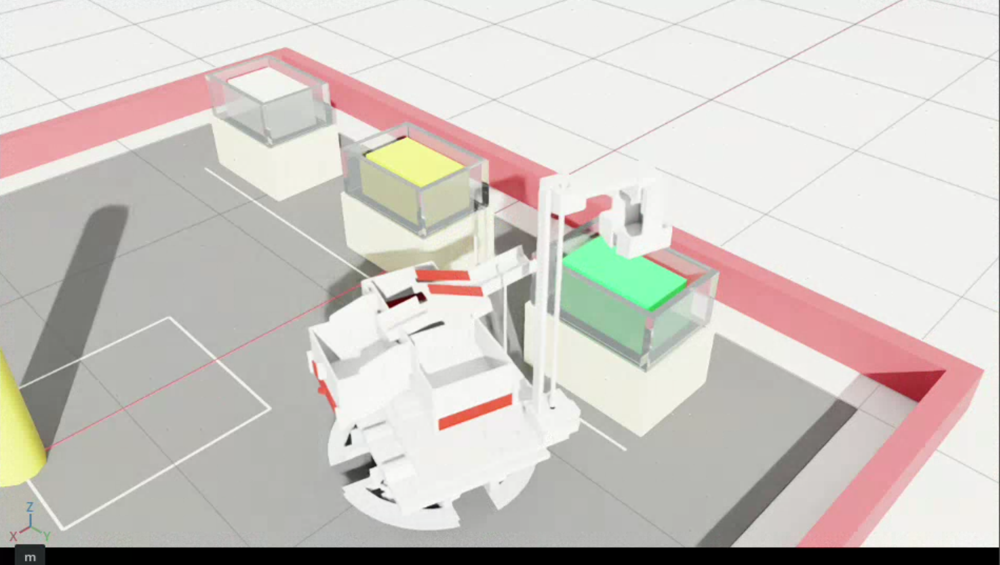

# Isaacsim Logistics Sorting Robot

<p align="center">
  
</p>

基于 Isaac Sim 的机电一体化课程设计物流任务仿真项目。项目包含物流比赛场地生成、真实机器人 URDF/STL 模型导入、A* 路径规划、取货动作、分拣挡板动作、卸货动作，以及独立的 2D LiDAR 已知地图定位原型。

## 🎬 Demo 视频

完整视频在release可查看

[[View demo video in Releases](../../releases/tag/v1.0demo)
](https://github.com/Hazzzard-LYX/Isaacsim-logistics-sorting-robot/releases/tag/V1.0-demo)

## 功能概览

- 生成物流比赛场地 USD 场景，包括围栏、货箱、取货区、放置区、障碍物、地面标识和标签。
- 导入 `final-urdf` 真实机器人模型，并将其挂载到可移动的机器人根节点下。
- 使用 A* 网格规划机器人巡检路径，并对路径进行折线简化和直线合并。
- 执行完整任务流程：取货区识别、夹爪取货、bank 分拣、放置区识别、料仓卸货、返回起点。
- 提供静态场景打开脚本，便于单独检查场地和机器人模型初始姿态。
- 提供独立 LiDAR scan matching 原型，用于说明后续真实雷达定位接入方案。

## 目录结构

```text
.
├── README.md
├── src/
│   ├── create_logistics_field.py
│   ├── final_robot_model.py
│   ├── run_path_planning_demo.py
│   ├── open_logistics_field.py
│   └── lidar_localization.py
├── assets/
│   └── robot/
│       └── final-urdf/
│           ├── urdf/final-urdf.urdf
│           ├── meshes/*.STL
│           ├── config/
│           ├── launch/
│           ├── package.xml
│           └── CMakeLists.txt
└── docs/
    ├── 项目详细说明文档.md
    ├── 雷达定位与路径规划算法说明.md
    └── 深度相机视觉识别方案说明.md
```

## 环境要求

本项目面向 Isaac Sim / Isaac Lab Python 环境运行。原开发环境使用：

```text
/home/hazzzard/anaconda3/envs/env_isaaclab/bin/python
```

如果在其他机器运行，需要保证：

- 已安装 Isaac Sim，并能在 Python 中导入 `isaacsim`、`omni.usd`、`pxr`。
- 当前终端有图形界面权限，非 headless 模式可以打开 Isaac Sim 窗口。
- 仓库目录结构保持不变，尤其是 `src/` 与 `assets/robot/final-urdf/` 的相对位置。

## 快速运行

进入仓库根目录：

```bash
cd logistics-field-robot-sim
```

运行完整巡检、取货、分拣、卸货流程：

```bash
env ISAAC_HEADLESS=0 PYTHONUNBUFFERED=1 /home/hazzzard/anaconda3/envs/env_isaaclab/bin/python src/run_path_planning_demo.py
```

只打开静态场景，不执行巡检：

```bash
env ISAAC_HEADLESS=0 PYTHONUNBUFFERED=1 /home/hazzzard/anaconda3/envs/env_isaaclab/bin/python src/open_logistics_field.py
```

单独运行 LiDAR 定位原型：

```bash
python3 src/lidar_localization.py
```

## 主要脚本说明

| 文件 | 作用 |
|---|---|
| `src/create_logistics_field.py` | 生成物流场地 USD，包含场地、货箱、物料颜色、数字标签、障碍物和传感器挂载点。 |
| `src/final_robot_model.py` | 导入 `assets/robot/final-urdf` 中的机器人 URDF/STL，并设置模型偏移、贴地高度、初始夹爪姿态和红色分拣部件材质。 |
| `src/run_path_planning_demo.py` | 完整演示入口，执行路径规划、巡检、取货、分拣、卸货和返回起点。 |
| `src/open_logistics_field.py` | 静态场景入口，只生成并打开场景，适合检查模型姿态和场地布局。 |
| `src/lidar_localization.py` | 独立 2D LiDAR 已知地图定位原型，不依赖 Isaac Sim。 |

## 当前任务流程

完整流程由 `src/run_path_planning_demo.py` 控制：

```text
生成场地 USD
  -> 打开 USD stage
  -> 导入真实机器人模型
  -> 读取初始位姿
  -> A* 路径规划到取货区
  -> 识别取货箱物料颜色
  -> 执行夹爪取货动作
  -> 调整 bank 挡板分拣
  -> A* 路径规划到放置区
  -> 识别放置箱数字标签
  -> 旋转车身并移动云台
  -> 打开对应料仓门卸货
  -> 返回起点
```

当前取货区物料颜色为：

```text
yellow / green / white
```

当前卸货标签映射为：

```text
1 -> r_gate
2 -> l_gate
3 -> f_gate
4 -> no action
5 -> no action
```

## 机器人模型

最终采用的机器人模型位于：

```text
assets/robot/final-urdf/
```

Isaac Sim 运行时会由 `src/final_robot_model.py` 创建临时 URDF：

```text
.final_urdf_runtime/final_robot.urdf
```

该临时文件用于把 URDF 中的 mesh 路径替换为绝对路径，避免 Isaac Sim 导入器解析 `package://` 路径失败。`.final_urdf_runtime/` 是运行时生成目录，不需要提交。

## 实现边界

当前项目重点是任务级可视化和流程演示，需要注意以下边界：

- 主流程中的路径规划是真实 A* 网格规划。
- 主流程中的机器人移动是直接更新 USD 根节点位姿，不是轮子动力学闭环控制。
- 主流程中的视觉识别目前读取 USD 属性，不是真实相机图像识别。
- 主流程中的 LiDAR 位姿目前读取 LiDAR prim 世界坐标，不是真实 scan matching 输出。
- `src/lidar_localization.py` 是独立 LiDAR 定位算法原型，尚未接入主巡检流程。

更完整的原理说明见 `docs/` 目录。

## 生成文件

运行脚本后可能生成：

```text
logistics_field_stage.usd
.final_urdf_runtime/
__pycache__/
```

这些都是运行时产物，已在 `.gitignore` 中排除。
